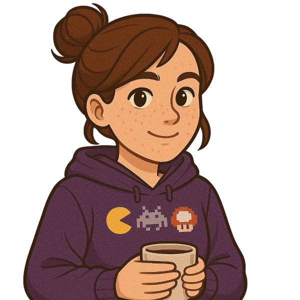

  
<h3>Oi! Sou a Kallyne, estudante de desenvolvimento web, apaixonada por criatividade e movida pela curiosidade. Adoro transformar ideias em projetos reais e funcionais através do código.</h3>

Tenho trabalhado em projetos de aprendizado e pessoais para explorar as possibilidades de criar experiências digitais úteis e interessantes. Meu objetivo é crescer continuamente, enfrentar novos desafios e melhorar minhas habilidades a cada passo.

Também sou muito apaixonada por videogames e por conhecer novas culturas e perspectivas — estou sempre aberta a aprender algo novo.

Fique à vontade para explorar meus projetos e ver meu código com seus próprios olhos. Vamos construir algo incrível!

